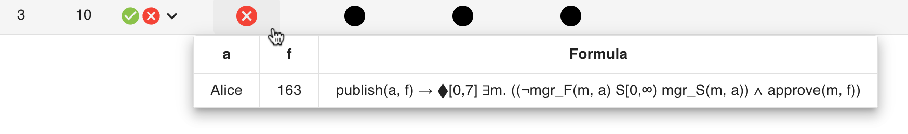
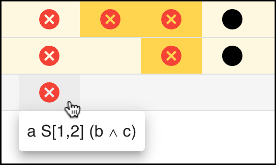

# Help

To start, you can select one of the predefined examples using the dropdown menu.

Alternatively, you can write your own Metric Temporal Logic specification and trace. The syntax is the following:

### Metric Temporal Logic
```
{f} ::=   true
        | false
        | {ATOM}
        | NOT {f}
        | {f} AND {f}
        | {f} OR  {f}
        | {f} IFF {f}
        | {f} IMPLIES {f}
        | PREV{i} {f}
        | NEXT{i} {f}
        | ONCE{i} {f}
        | EVENTUALLY{i} {f}
        | HISTORICALLY{i} {f}
        | ALWAYS{i} {f}
        | {f} SINCE{i} {f}
        | {f} UNTIL{i} {f}
        | {f} TRIGGER{i} {f}
        | {f} RELEASE{i} {f}

{i}  ::= [{NAT}, {UPPERBOUND}]
{UPPERBOUND} ::= {NAT} | INFINITY
```

### Trace
```
{TRACE} :=   @{NAT} {ATOM}*
           | @{NAT} {ATOM}* \n {TRACE}
```

Once you have a valid MTL formula and trace, you can enter the monitoring state by clicking on the button:


At this point, you should be able to see a table with satisfactions and violations, where each row corresponds to a single event.
The first columns consist of the atomic propositions occurring in your formula.
Next, you have two columns: TS (time-stamps) and TP (time-points).
Up until this column, the table solely represents the trace (from top to bottom).
The following columns correspond to different subformulas of your MTL formula ϕ.

The first column corresponds to ϕ itself, and at every time-point where it is possible to output a verdict, the Explanator2 shows a Boolean verdict for ϕ.

Moreover, in the table header only the main operator of a subformula is shown.
To see the entire subformula, you can hover your cursor over a Boolean verdict:



In addition, you can inspect a Boolean verdict by clicking on it:



Whenever you click on a Boolean verdict, the Explanator2 shows and highlights an explanation for the Boolean verdict currently being inspected.
Furthermore, it also highlights the time interval associated with the corresponding subformula.
You may further inspect Boolean verdicts until you reach atomic propositions.

In the monitoring state, three different buttons are displayed:


You can add events to your trace using the text area on the left and clicking on the *plus* button.
At every moment you can reset the state of your table by clicking on the *refresh* button.
Lastly, you can make changes to your MTL formula and/or trace by clicking on the *close* button, exiting the monitoring state.