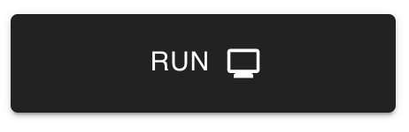
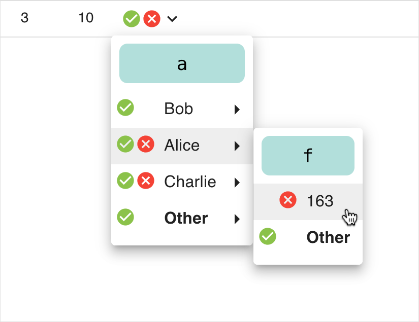
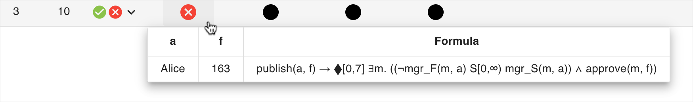
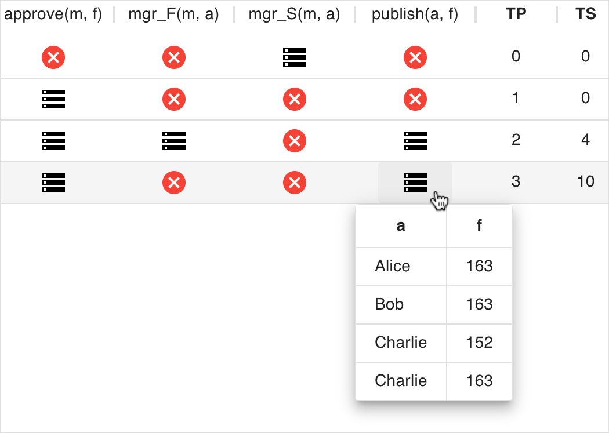
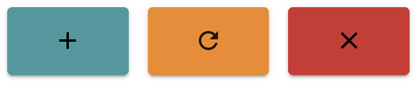

# Quickstart

Welcome! To start, you can select one of the predefined examples using the dropdown menu.

Alternatively, you can specify your own signature, Metric First-Order Temporal Logic formula and trace.

Once you have a valid signature, trace and MFOTL formula, you can enter the monitoring state by clicking on:

At this point, you should be able to see a table where each row corresponds to a specific time-point.  
This table includes the columns TP (time-points), TS (time-stamps), and Values.  
The other columns correspond to the different subformulas of your input MFOTL formula ϕ.

For each time-point, the Values column includes buttons for satisfactions or violations or both.  
After clicking on such a button, you are presented with a dropdown menu, where it is possible to choose a variable assignment for each of the free variables in ϕ.  
From now on, we will consider the *publish-approve-manager* example.  
A possible selection at time-point 3 corresponds to:

Note that in the table header only the main operator of each subformula is shown.  
After deciding the variable assignments, a Boolean verdict will appear in the next column → (representing ϕ itself).  
To see the entire subformula, you can hover your cursor over a Boolean verdict.  
For instance, hovering the Boolean verdict of ϕ at time-point 3 results in:

This will also show the variable assignment considering in your current inspection.  
At this point, you can inspect the Boolean verdict by clicking on it:

Whenever you click on a Boolean verdict, **WhyMon** shows and highlights the Boolean verdicts associated with its justification.  
Furthermore, it highlights the columns of the subformulas of the current inspection (here in yellow and teal).  
If the topmost operator of the current inspection is a temporal operator, the time interval associated with it is also highlighted.  
You may further inspect Boolean verdicts until you reach predicates.

You can also enable some optional features.  
For instance, you can select the option Trace and see the events for each time-point:

Lastly, three different buttons are displayed in the monitoring state:

You can append events to the trace by using the text area *New events* on the left and clicking on the *plus* button.  
At every moment you can reset the state of the table by clicking on the *refresh* button.  
You can exit the monitoring state by clicking on the *close* button.